# SwiftExtras

SwiftExtras is a Swift Package containing Extensions and Helpers for Swift which I use on a regular basis, or find useful.

[](https://swiftpackageindex.com/0xWDG/SwiftExtras)
[](https://swiftpackageindex.com/0xWDG/SwiftExtras)
[](https://swift.org/package-manager)


## Requirements

- Swift 5.9+ (Xcode 15+)
- iOS 16+, macOS 13+, tvOS 16+, watchOS 9+

## Installation (Pakage.swift)

```swift
dependencies: [
    .package(url: "https://github.com/0xWDG/SwiftExtras.git", branch: "main"),
],
targets: [
    .target(name: "MyTarget", dependencies: [
        .product(name: "SwiftExtras", package: "SwiftExtras"),
    ]),
]
```

## Installation (Xcode)

1. In Xcode, open your project and navigate to **File** → **Swift Packages** → **Add Package Dependency...**
2. Paste the repository URL (`https://github.com/0xWDG/SwiftExtras`) and click **Next**.
3. Click **Finish**.

## Update Screenshots

`swift run SwiftExtrasScreenshots`

## Custom Views (+ Screenshots)

The screenshot assets are shared with the DocC catalog and can be refreshed with the command above.

| View | Screenshot |
| --- | --- |
| CardView | 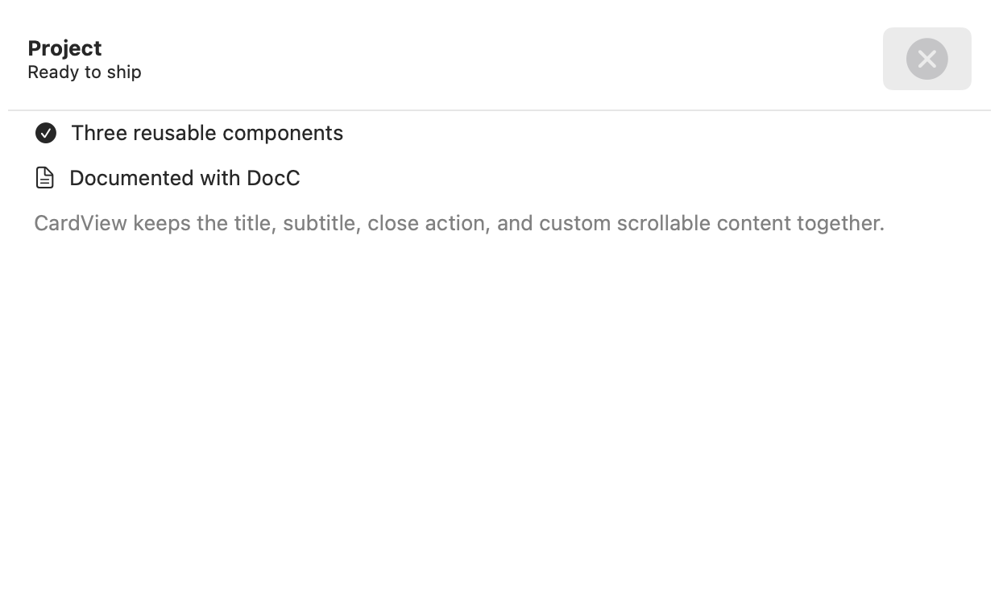 |
| CarouselView | 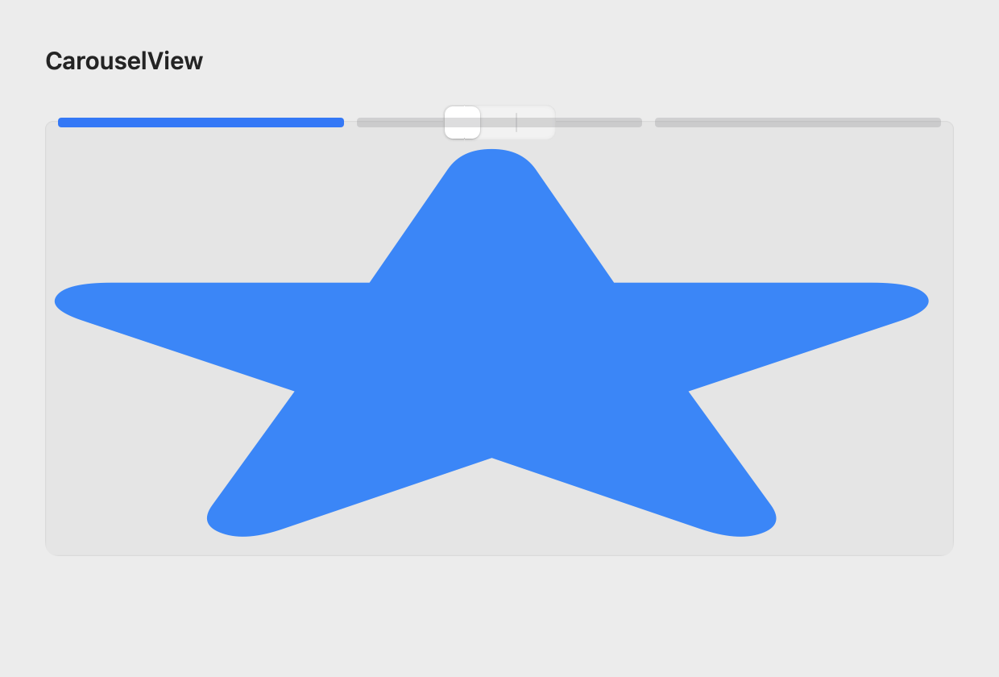 |
| ConfirmationButton | 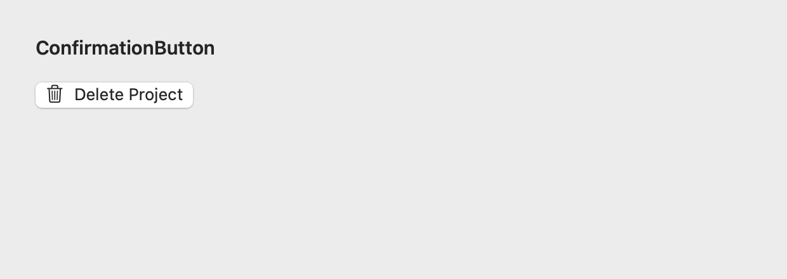 |
| DisclosureSection | 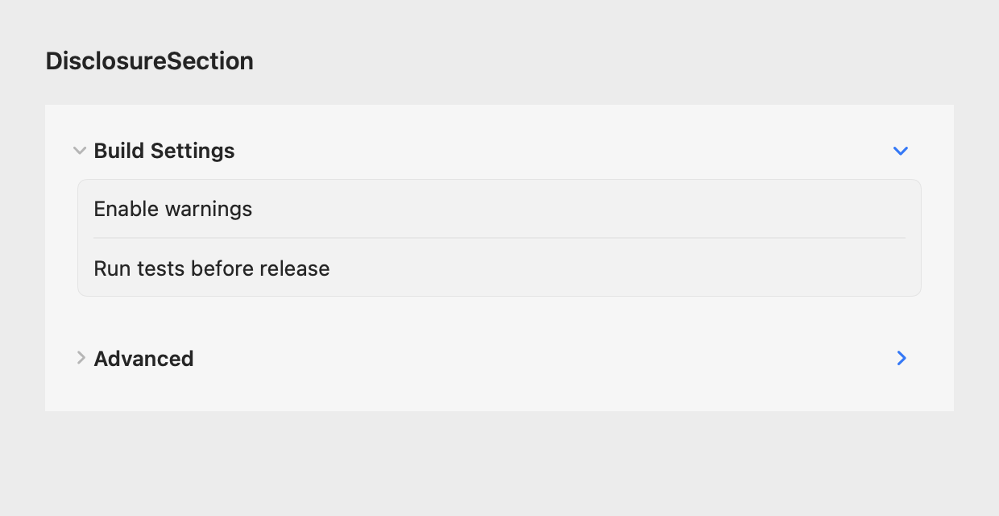 |
| HorizontalStepper | 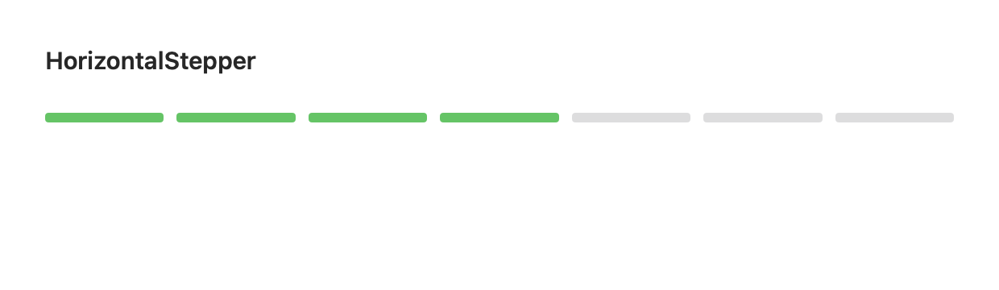 |
| IndexedList | 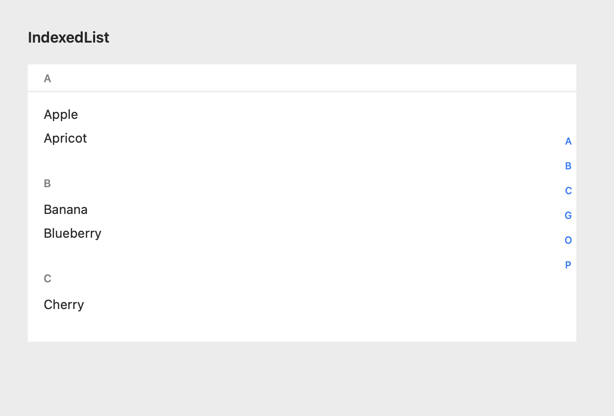 |
| LabeledTextField | 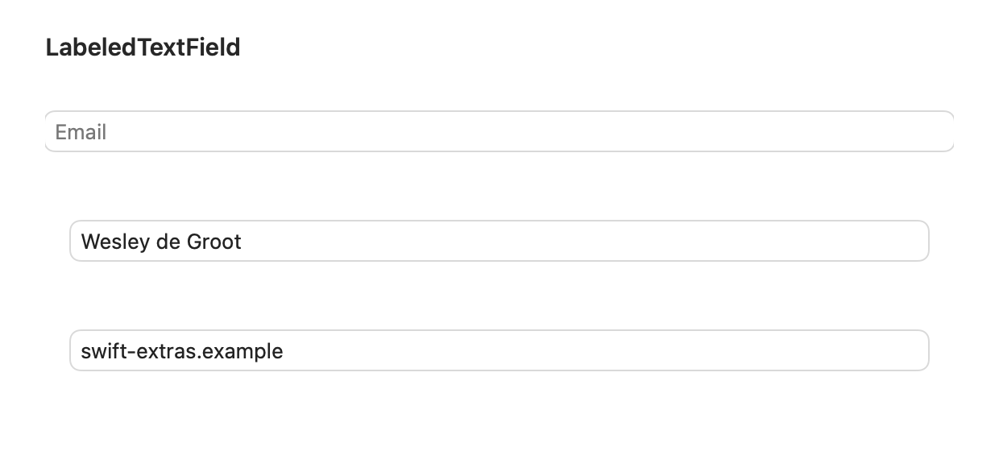 |
| LimitedTextField | 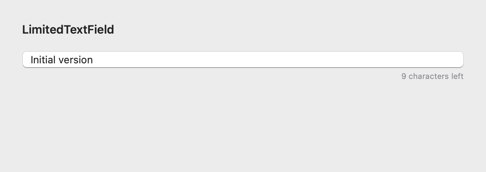 |
| MonthYearPickerView | 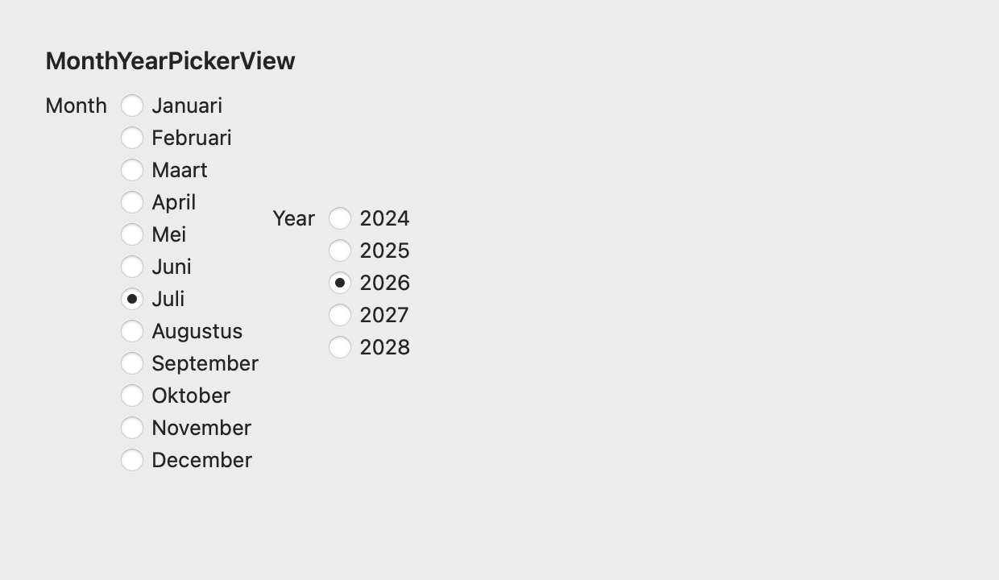 |
| MultiSelectPickerView | 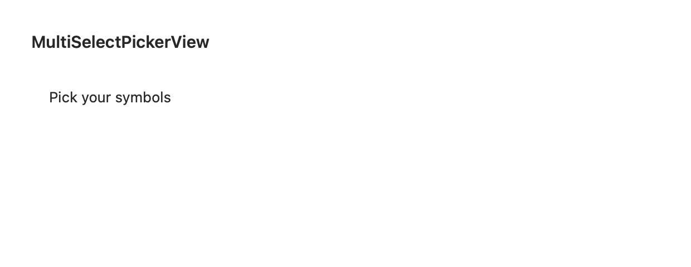 |
| MultiSelectView | 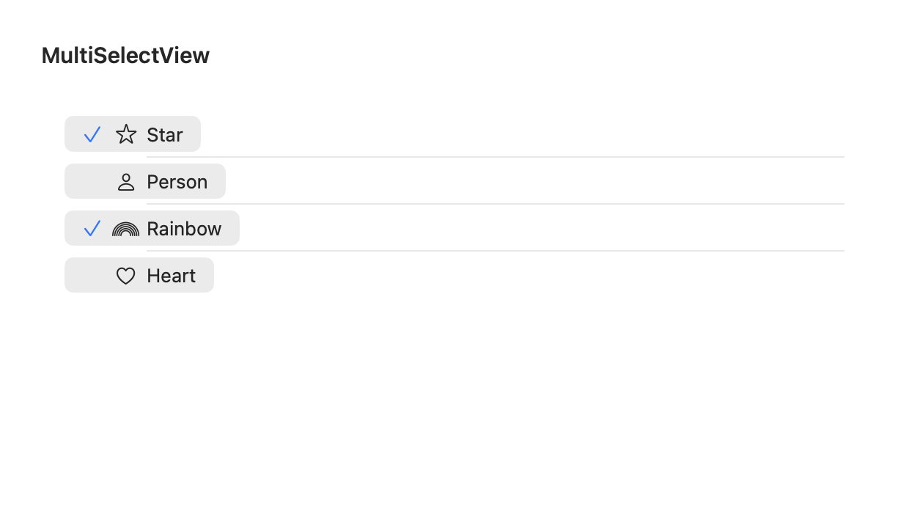 |
| NotificationView | 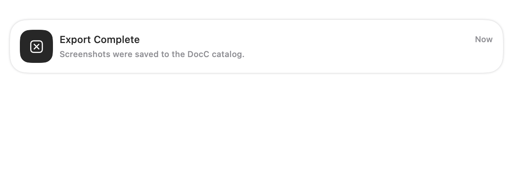 |
| SEAcknowledgementView | 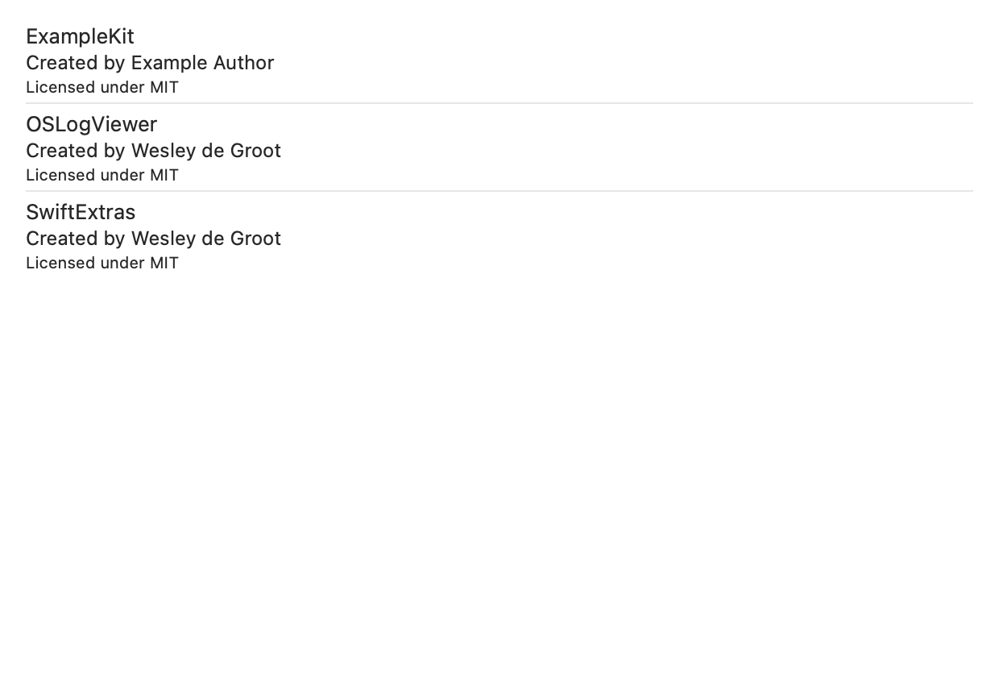 |
| SEChangeLogView | 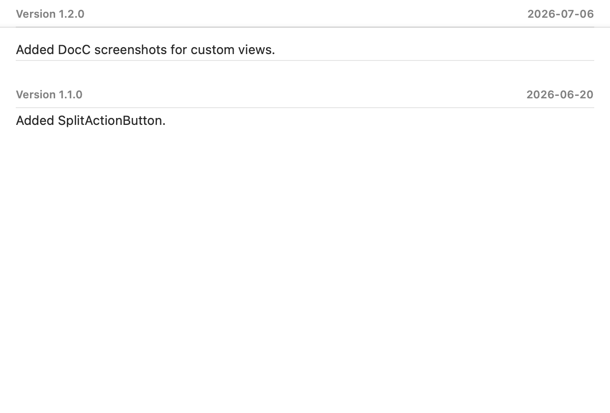 |
| SplitActionButton | 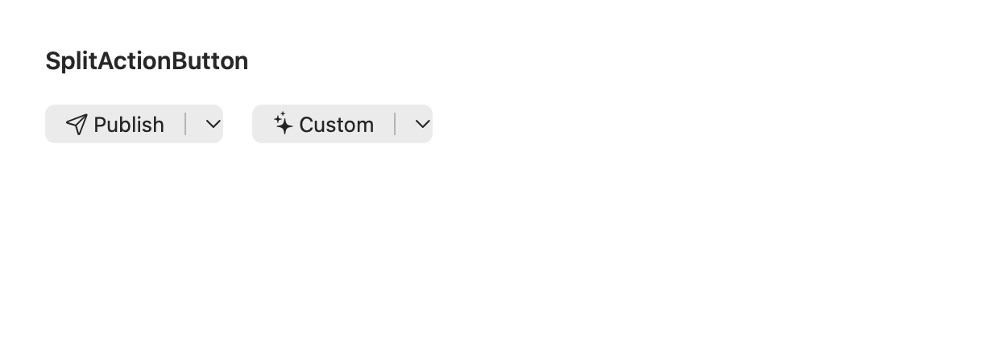 |
| WStack | 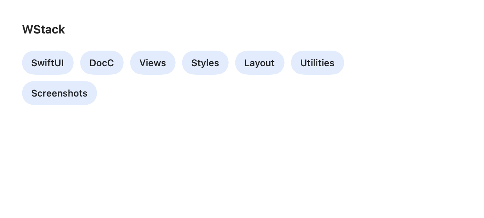 |


## Contact

🦋 [@0xWDG](https://bsky.app/profile/0xWDG.bsky.social)
🐘 [mastodon.social/@0xWDG](https://mastodon.social/@0xWDG)
🐦 [@0xWDG](https://x.com/0xWDG)
🧵 [@0xWDG](https://www.threads.net/@0xWDG)
🌐 [wesleydegroot.nl](https://wesleydegroot.nl)
🤖 [Discord](https://discordapp.com/users/918438083861573692)

Interested learning more about Swift? [Check out my blog](https://wesleydegroot.nl/blog/).
